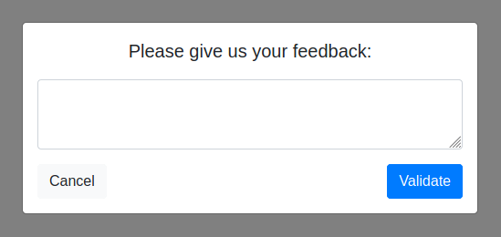

# Bootstrap 4 dialogs

[](https://github.com/bgaze/bootstrap4-dialogs/blob/master/LICENSE)

[](https://github.com/bgaze/bootstrap4-dialogs/releases)
[](https://github.com/bgaze/bootstrap4-dialogs/stargazers)
[](https://www.npmjs.com/package/bgaze-bootstrap4-dialogs)



BSD is a tiny and flexible collection of dialog popups based on Bootstrap 4 modals.  
Custom dialogs can be easily defined, in addition to built-in ones (alert, confirm and prompt).

## Documentation

Full documentation and examples are available at [https://packages.bgaze.fr/bootstrap4-dialogs](https://packages.bgaze.fr/bootstrap4-dialogs)

## Quick start

BSD requires jQuery v1.9+ and Bootstrap 4 modal component.

Several quick start options are available:

*   Install with npm: `npm i bgaze-bootstrap4-dialogs`
*   Install with yarn: `yarn add bgaze-bootstrap4-dialogs`
*   Install via CDN: `https://cdn.jsdelivr.net/gh/bgaze/bootstrap4-dialogs@2/dist/bootstrap4-dialogs.min.js`
*   Install with Composer: `composer require bgaze/bootstrap4-dialogs`
*   Download the latest release: [https://github.com/bgaze/bootstrap4-dialogs/releases](https://github.com/bgaze/bootstrap4-dialogs/releases)
*   Clone the repo: `git clone https://github.com/bgaze/bootstrap4-dialogs.git`

Just make sure to include required dependencies into your app, then include the library:

*   If installed as a module, import it: `const bsd = require("bgaze-bootstrap4-dialogs");`
*   Otherwise include the script into your page: `<script src="path/to/bootstrap4-dialogs.js"></script>`

That's it! Now you can use the globally declared `bsd` object.

```javascript
// Alert
bsd.alert('Lorem ipsum dolor sit amet');

// Confirm
bsd.confirm('Lorem ipsum dolor sit amet', function (confirmed) {
    if (confirmed) {
        // ...
    }
});

// Prompt
bsd.prompt('Lorem ipsum dolor sit amet', function (value) {
    if (value !== null) {
        if (value.trim() === '') {
            // Prevent dialog closing, as provided value is empty.
            return false;
        } 

        console.log(value);
    }
});
```
